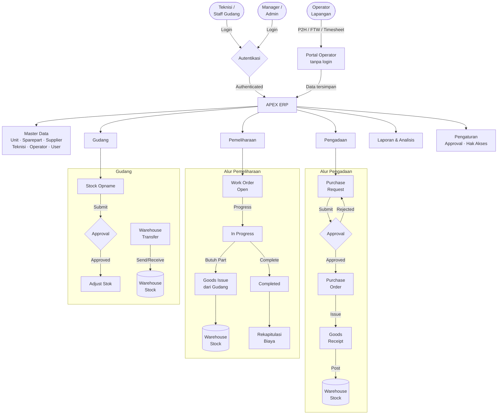
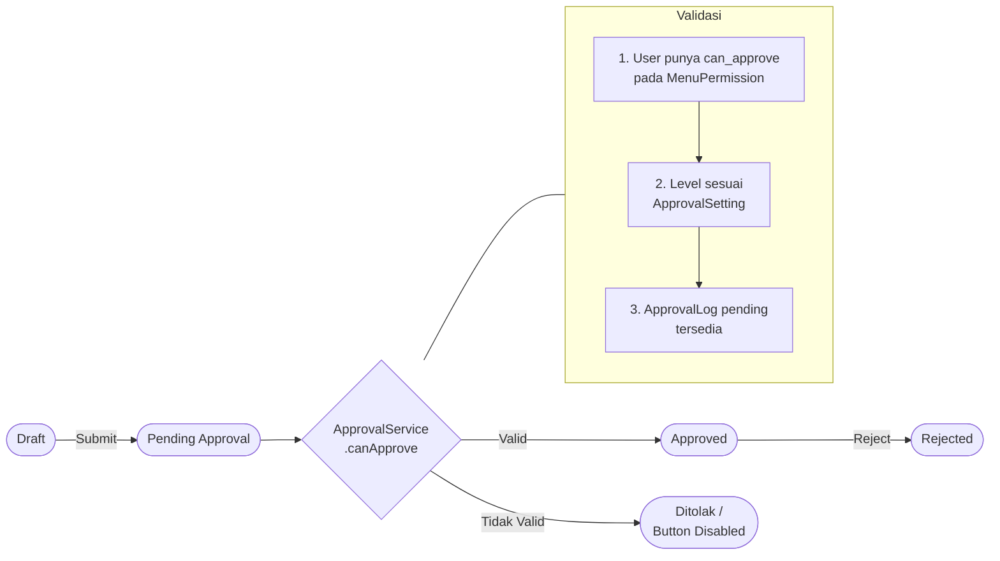
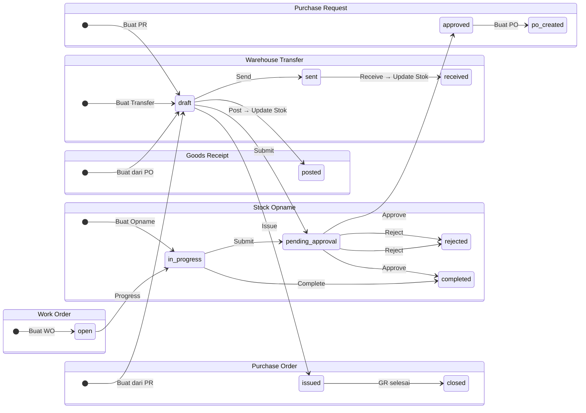

# APEX — Mining ERP System

> **Asset & Plant ERP for Extraction**
> Sistem ERP terintegrasi untuk industri pertambangan — mengelola work order, inventaris sparepart, pengadaan, dan operasional workshop alat berat secara menyeluruh.

Dikembangkan oleh **Fluxa Borneo Tech**.

---

## Fitur Utama

| Modul | Deskripsi |
|---|---|
| **Work Order** | Pencatatan & pelacakan perbaikan/perawatan unit alat berat |
| **P2H Check** | Pemeriksaan harian pra-penggunaan unit oleh operator |
| **Fit to Work** | Form kesehatan harian operator (portal tanpa login) |
| **Timesheet** | Pencatatan jam kerja operator (portal tanpa login) |
| **Downtime Analysis** | Analisis downtime unit berdasarkan Work Order |
| **Purchase Request** | Pengajuan pembelian dengan workflow approval multi-level |
| **Purchase Order** | Order pembelian ke supplier |
| **Consumable PR** | Pengajuan khusus barang konsumabel |
| **Goods Receipt** | Penerimaan barang dari supplier |
| **Goods Issue** | Pengeluaran barang untuk kebutuhan perbaikan |
| **Stock Opname** | Verifikasi stok fisik dengan approval |
| **Warehouse Transfer** | Transfer barang antar lokasi gudang |
| **Laporan** | Ketersediaan unit, biaya perbaikan, pergerakan stok, analisis komplain |
| **Notifikasi** | Notifikasi in-app untuk setiap event bisnis |
| **Hak Akses** | Manajemen role & permission per menu secara granular |

---

## Tech Stack

| Layer | Teknologi |
|---|---|
| Backend | Laravel 11 (PHP 8.2+) |
| Database | MySQL / MariaDB |
| Frontend | Blade Templating + Bootstrap 5 |
| UI Icons | Bootstrap Icons |
| Charts | Chart.js |
| Select Input | Tom Select |
| Authentication | Laravel Session Auth |

---

## Instalasi

### Prasyarat
- PHP 8.2+
- Composer
- MySQL / MariaDB
- XAMPP / Laragon (opsional)

### Langkah Instalasi

```bash
# 1. Clone repository
git clone https://github.com/eddyyucca/anugerah-sarana-hikmah-main.git
cd anugerah-sarana-hikmah-main

# 2. Install dependencies
composer install

# 3. Setup environment
cp .env.example .env

# 4. Generate app key
php artisan key:generate

# 5. Konfigurasi database di .env
DB_DATABASE=apex_erp
DB_USERNAME=root
DB_PASSWORD=

# 6. Jalankan migration dan seeder
php artisan migrate
php artisan db:seed

# 7. Jalankan server
php artisan serve
```

Akses aplikasi: **http://localhost:8000**

---

## Modul & Route

| Modul | Route | Deskripsi |
|---|---|---|
| Dashboard | `/` | KPI, chart, ringkasan |
| Units | `/units` | Master data unit alat berat |
| Spareparts | `/spareparts` | Master data suku cadang |
| Suppliers | `/suppliers` | Master data supplier |
| Technicians | `/technicians` | Master data teknisi |
| Operators | `/operators` | Master data operator |
| Users | `/users` | Manajemen pengguna |
| Purchase Request | `/purchase-requests` | Pengajuan pembelian |
| Consumable PR | `/consumable-pr` | Pengajuan barang konsumabel |
| Purchase Order | `/purchase-orders` | Order pembelian ke supplier |
| Goods Receipt | `/goods-receipts` | Penerimaan barang |
| Goods Issue | `/goods-issues` | Pengeluaran barang |
| Stock Opname | `/stock-opname` | Verifikasi stok fisik |
| Warehouse Transfer | `/warehouse-transfer` | Transfer antar gudang |
| Work Orders | `/work-orders` | Order perbaikan unit |
| Downtime Analysis | `/downtime` | Analisis downtime |
| P2H Check | `/p2h` | Pemeriksaan harian unit |
| Fit to Work | `/fit-to-work` | Pemeriksaan kesehatan operator |
| Timesheet | `/timesheets` | Jam kerja operator |
| Operasi Log | `/operasi/log` | Log & laporan operasional |
| Reports | `/reports` | Laporan & analisis |
| Notifications | `/notifications` | Notifikasi in-app |
| Menu Permissions | `/settings/menu` | Konfigurasi akses role |
| Approval Settings | `/settings/approval` | Konfigurasi level approval |

### Portal Operator (Tanpa Login)

| URL | Fungsi |
|---|---|
| `/operator` | Halaman landing portal operator |
| `/operator/p2h` | Form Pre-Trip / Pre-Use Inspection |
| `/operator/fit-to-work` | Form Fit to Work harian |
| `/operator/timesheet` | Form Timesheet jam kerja |

---

## Diagram Alur Proses (DFD Level 1)



---

## Alur Approval Dokumen



---

## Alur Status Dokumen



---

## ERD (Entity Relationship Diagram)

```mermaid
erDiagram
    users {
        int id PK
        string name
        string email
        string role
        string department
        int warehouse_location_id FK
        boolean is_active
    }
    menu_permissions {
        int id PK
        string role
        string menu_key
        boolean can_view
        boolean can_create
        boolean can_edit
        boolean can_delete
        boolean can_approve
    }
    approval_settings {
        int id PK
        string document_type
        string level_name
        int level_order
        string approver_role
        int approver_user_id FK
        decimal min_amount
        decimal max_amount
    }
    approval_logs {
        int id PK
        string document_type
        int document_id
        int approval_setting_id FK
        string level_name
        int level_order
        string action
        int acted_by FK
        datetime acted_at
    }
    units {
        int id PK
        string unit_code
        string unit_name
        int unit_category_id FK
        string status
    }
    unit_categories {
        int id PK
        string name
    }
    technicians {
        int id PK
        string name
        string skill
        string phone
    }
    operators {
        int id PK
        string name
        string employee_id
        string phone
    }
    work_orders {
        int id PK
        string wo_number
        int unit_id FK
        int technician_id FK
        string maintenance_type
        string repair_location
        string status
        datetime start_time
        datetime end_time
        decimal downtime_hours
        decimal labor_cost
        decimal vendor_cost
        decimal consumable_cost
        int created_by FK
    }
    work_order_logs {
        int id PK
        int work_order_id FK
        string action
        string notes
        int created_by FK
    }
    repair_cost_summaries {
        int id PK
        int work_order_id FK
        decimal sparepart_cost
        decimal labor_cost
        decimal total_cost
    }
    spareparts {
        int id PK
        string part_code
        string part_name
        int sparepart_category_id FK
        string unit
        decimal price
    }
    sparepart_categories {
        int id PK
        string name
    }
    warehouse_locations {
        int id PK
        string name
        string code
    }
    warehouse_stocks {
        int id PK
        int sparepart_id FK
        int warehouse_location_id FK
        int qty
    }
    stock_movements {
        int id PK
        int sparepart_id FK
        int warehouse_location_id FK
        string type
        int qty
        string reference
        int created_by FK
    }
    suppliers {
        int id PK
        string name
        string contact
        string address
    }
    purchase_requests {
        int id PK
        string pr_number
        date request_date
        int request_by FK
        string status
        int approved_by FK
        datetime approved_at
    }
    purchase_request_items {
        int id PK
        int purchase_request_id FK
        int sparepart_id FK
        int qty_requested
        decimal estimated_price
    }
    purchase_orders {
        int id PK
        string po_number
        int purchase_request_id FK
        int supplier_id FK
        string status
        date po_date
    }
    purchase_order_items {
        int id PK
        int purchase_order_id FK
        int sparepart_id FK
        int qty_order
        decimal unit_price
    }
    goods_receipts {
        int id PK
        string gr_number
        int purchase_order_id FK
        date receipt_date
        string status
        int posted_by FK
        datetime posted_at
    }
    goods_receipt_items {
        int id PK
        int goods_receipt_id FK
        int sparepart_id FK
        int qty_received
        decimal unit_price
    }
    goods_issues {
        int id PK
        string gi_number
        int work_order_id FK
        date issue_date
        string status
        int posted_by FK
        datetime posted_at
    }
    goods_issue_items {
        int id PK
        int goods_issue_id FK
        int sparepart_id FK
        int qty
        decimal unit_price
    }
    stock_opnames {
        int id PK
        string opname_number
        date opname_date
        string status
        int conducted_by FK
        int submitted_by FK
        int approved_by FK
        datetime approved_at
    }
    stock_opname_items {
        int id PK
        int stock_opname_id FK
        int sparepart_id FK
        int qty_system
        int qty_actual
        boolean is_counted
    }
    warehouse_transfers {
        int id PK
        string transfer_number
        int from_location_id FK
        int to_location_id FK
        string status
        int sent_by FK
        int received_by FK
    }
    warehouse_transfer_items {
        int id PK
        int warehouse_transfer_id FK
        int sparepart_id FK
        int qty
    }
    p2h_checks {
        int id PK
        string p2h_number
        int unit_id FK
        int operator_id FK
        date check_date
        string shift
        string overall_status
        int reviewed_by FK
    }
    p2h_check_items {
        int id PK
        int p2h_check_id FK
        string check_item
        string condition
        string notes
    }
    fit_to_works {
        int id PK
        int operator_id FK
        date check_date
        string shift
        string status
        string notes
    }
    timesheets {
        int id PK
        int operator_id FK
        int p2h_check_id FK
        int unit_id FK
        date work_date
        string shift
        decimal hours_worked
    }
    notifications {
        int id PK
        int user_id FK
        string title
        string message
        string url
        boolean is_read
    }

    users ||--o{ work_orders : "creates"
    users ||--o{ purchase_requests : "requests"
    users ||--o{ approval_logs : "acts on"
    users ||--o{ notifications : "receives"
    users }o--|| warehouse_locations : "default location"

    units }o--|| unit_categories : "categorized by"
    work_orders }o--|| units : "for unit"
    work_orders }o--|| technicians : "assigned to"
    work_orders ||--o{ work_order_logs : "logged in"
    work_orders ||--o{ goods_issues : "requires parts via"
    work_orders ||--o| repair_cost_summaries : "summarized in"

    spareparts }o--|| sparepart_categories : "categorized by"
    warehouse_stocks }o--|| spareparts : "tracks"
    warehouse_stocks }o--|| warehouse_locations : "at"
    stock_movements }o--|| spareparts : "moves"
    stock_movements }o--|| warehouse_locations : "at"

    purchase_requests ||--o{ purchase_request_items : "contains"
    purchase_request_items }o--|| spareparts : "for"
    purchase_requests ||--o{ purchase_orders : "generates"
    purchase_orders }o--|| suppliers : "to"
    purchase_orders ||--o{ purchase_order_items : "contains"
    purchase_orders ||--o{ goods_receipts : "received via"
    goods_receipts ||--o{ goods_receipt_items : "contains"
    goods_receipt_items }o--|| spareparts : "for"

    goods_issues ||--o{ goods_issue_items : "contains"
    goods_issue_items }o--|| spareparts : "issues"

    stock_opnames ||--o{ stock_opname_items : "counts"
    stock_opname_items }o--|| spareparts : "for"

    warehouse_transfers ||--o{ warehouse_transfer_items : "contains"
    warehouse_transfer_items }o--|| spareparts : "transfers"
    warehouse_transfers }o--|| warehouse_locations : "from"
    warehouse_transfers }o--|| warehouse_locations : "to"

    p2h_checks }o--|| units : "checks"
    p2h_checks }o--|| operators : "by"
    p2h_checks ||--o{ p2h_check_items : "details"
    p2h_checks ||--o| timesheets : "linked to"

    fit_to_works }o--|| operators : "by"
    timesheets }o--|| operators : "by"
    timesheets }o--|| units : "for"

    approval_logs }o--|| approval_settings : "based on"
```



---

## Role & Hak Akses

Permission dikonfigurasi melalui tabel `menu_permissions` per role. Admin memiliki akses penuh secara otomatis.

| Aksi | Kolom DB |
|---|---|
| Lihat data | `can_view` |
| Buat data baru | `can_create` |
| Edit data | `can_edit` |
| Hapus data | `can_delete` |
| Approve dokumen | `can_approve` |

### Validasi Approval (ApprovalService)

Sebelum approve dokumen, sistem memvalidasi 3 kondisi sekaligus:
1. User memiliki `can_approve = true` di `menu_permissions` untuk menu terkait
2. Role/ID user sesuai konfigurasi `approval_settings` (level & nominal budget)
3. `approval_logs` berstatus `pending` untuk dokumen tersebut

---

## Struktur Direktori

```
app/
├── Http/Controllers/     # 27 controller (satu per modul)
├── Models/               # 35 model Eloquent
├── Services/
│   └── ApprovalService.php   # Logic validasi & eksekusi approval
resources/
├── views/                # Blade templates per modul
routes/
└── web.php               # Semua route aplikasi
database/
├── migrations/           # Skema tabel
└── seeders/              # Data awal
```

---

## Developer

**Eddy Adha Saputra**
GitHub: [https://github.com/eddyyucca](https://github.com/eddyyucca)

---

## Lisensi

Dikembangkan oleh **PT Anugerah Sarana Hikmah**. Hak cipta dilindungi.
